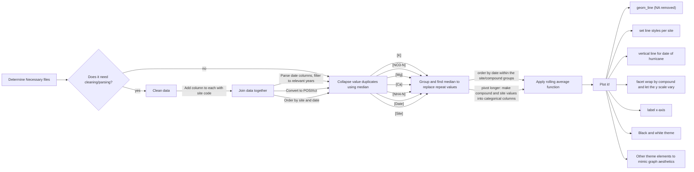
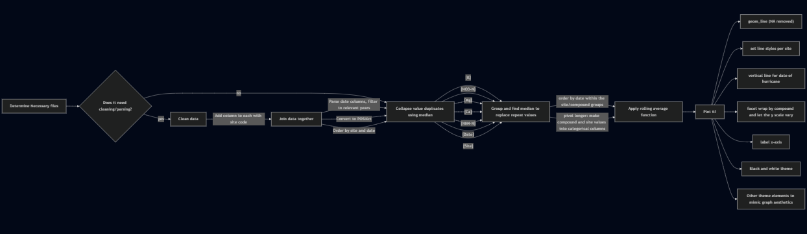

# Figure Reproduction

This repository contains code to reproduce Figure 2 from Schaefer et al.
(2000) paper *"Effects of hurricane disturbance on stream water
concentrations and fluxes in eight tropical forest watersheds of the
Luquillo Experimental Forest, Puerto Rico"*

## Data

The data can be downloaded
[here](https://portal.edirepository.org/nis/mapbrowse?packageid=knb-lter-luq.20.4923064).
The following are the data files whose download is required to run the
script. These files can be found in the [/data/raw_data](/data/raw)
folder: 
- Quebrada one-Bisley (Q1) Chemistry Data 
- Quebrada one-Bisley (Q2) Chemistry Data 
- Quebrada one-Bisley (Q3) Chemistry Data 
- Puente Roto Mameyes (MPR) Chemistry Data

## Contents

[**data**](/data): Contains raw and processed data

**Key Files**

<ul>

<li>

[processed_data](/data/processed_data)

<ul>

<li>
[cleaned_data.csv](/data/processed_data/cleaned_data.csv)
</li>

</ul>

</li>

<li>

[raw_data](/data/raw_data)

<ul>

<li>[Quebrada_Cuenca1-Bisley.csv](/data/raw_data/Quebrada_Cuenca1-Bisley.csv)</li>

<li>[Quebrada_Cuenca2-Bisley.csv](/data/raw_data/Quebrada_Cuenca2-Bisley.csv)</li>

<li>[Quebrada_Cuenca3-Bisley.csv](/data/raw_data/Quebrada_Cuenca3-Bisley.csv)</li>

<li>[RioMameyesPuenteRoto.csv](/data/raw_data/RioMameyesPuenteRoto.csv)</li>

</ul>

</li>

</ul>

[**paper**](/paper): Render this to run everything 

**Key Files**

<ul>

<li>
[paper.qmd](/paper/paper.qmd)
</li>

</ul>

[**docs**](/docs): Contains rendered paper 

**Key Files**

<ul>

<li>[paper.html](/docs/paper.html)</li>

</ul>

[**resources**](/resources): Contains the original figure we
are attempting to replicate and our analysis flowchart

Contains rendered paper **Key Files**

<ul>

<li>[figure_to_replicate](/figures/figure_to_replicate.png)</li>

<li>[flowchart.png](/figures/flowchart.png)</li>

</ul>

[**output**](/output)

Contains final replicated figure **Key Files**

<ul>

<li>[replica_plot.png](/output/replica_plot.png)</li>

</ul>

[**R**](/R): Contains functions used in analysis

Contains rendered paper **Key Files**

<ul>

<li>[calc_moving_avg.R](/R/calc_moving_avg.R)</li>

<li>[find_median.R](/R/find_median.R)</li>

</ul>

- [**0_init_env.R**](/0_init_env.R): Installs required libraries

- [**1_load_data.R**](/1_load_data.R): Loads raw data files

- [**2_process_data.R**](/1_process_data.R): performs the necessary analysis and plots

## Methods

The script takes four raw data files from @mcdowell2024 to replicate
**figure 2** from *Effects of hurricane disturbance on stream water
concentrations and fluxes in eight tropical forest watersheds of the
Luquillo Experimental Forest, Puerto Rico* [@schaefer2000].

The following flowchart describes the workflow the the analysis done to
replicate the figure.

## References

-   Schaefer, Doug & McDowell, William & Scatena, Frederick & Asbury,
    Clyde. (2000). *Effects of Hurricane Disturbance on Stream Water
    Concentrations and Fluxes in Eight Tropical Forest Watersheds of the
    Luquillo Experimental Forest, Puerto Rico*. Departmental Papers
    (EES). 16. 10.1017/S0266467400001358.

-   McDowell, W. and International Institute of Tropical Forestry(IITF),
    USDA Forest Service.. 2024. Chemistry of stream water from the
    Luquillo Mountains ver 4923064. Environmental Data Initiative.
    <https://doi.org/10.6073/pasta/f31349bebdc304f758718f4798d25458>
    (Accessed 2025-08-26).
