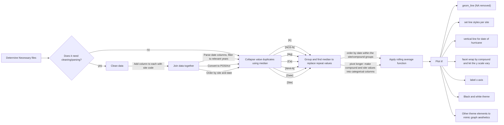

# Figure Reproduction 

This repository contains code to reproduce Figure 2 from Schaefer et al. (2000) paper *"Effects of hurricane disturbance on stream
water concentrations and fluxes in eight tropical
forest watersheds of the Luquillo Experimental
Forest, Puerto Rico"*

## Data
The data can be downloaded [here](https://portal.edirepository.org/nis/mapbrowse?packageid=knb-lter-luq.20.4923064). The following are the data files whose download is required to run the script. These files can be found in the [/data/raw_data](/data/raw) folder:
- Quebrada one-Bisley (Q1) Chemistry Data
- Quebrada one-Bisley (Q2) Chemistry Data 
- Quebrada one-Bisley (Q3) Chemistry Data 
- Puente Roto Mameyes (MPR) Chemistry Data

## Contents

- [:file_folder: paper](/paper): Render this to run everything
- [:file_folder: docs](/docs): Contains rendered paper
- [:file_folder: resources](/figures): Contains the original figure we are attempting to replicate and our analysis flowchart
- [:file_folder: scripts](/scripts): Contains utility, cleaning, analysis, and plotting scripts
- [:file_folder: data](/data): Includes raw (and processed) data
- [:file_folder: output](/output): Contains the resulting figure
- [:file_folder: scratch](/scratch): Render this to run everything

## Methods

## References
- Schaefer, Doug & McDowell, William & Scatena, Frederick & Asbury, Clyde. (2000). *Effects of Hurricane Disturbance on Stream Water Concentrations and Fluxes in Eight Tropical Forest Watersheds of the Luquillo Experimental Forest, Puerto Rico*. Departmental Papers (EES). 16. 10.1017/S0266467400001358. 

- McDowell, W. and International Institute of Tropical Forestry(IITF), USDA Forest Service.. 2024. Chemistry of stream water from the Luquillo Mountains ver 4923064. Environmental Data Initiative. https://doi.org/10.6073/pasta/f31349bebdc304f758718f4798d25458 (Accessed 2025-08-26).